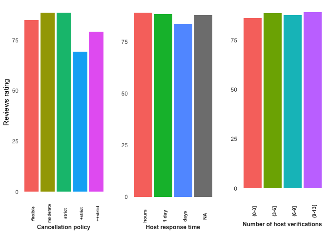
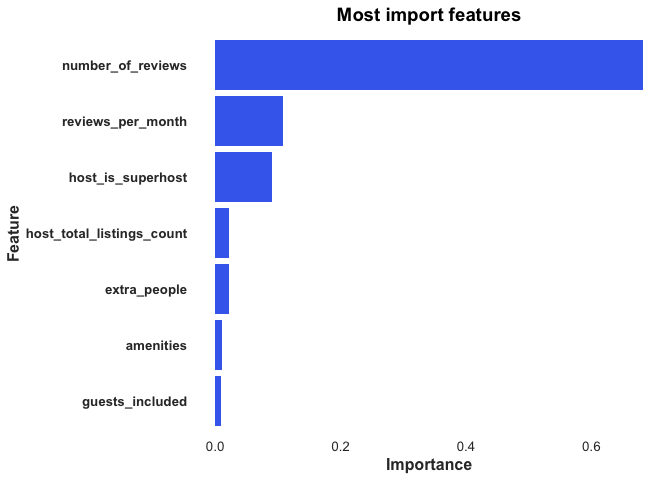

Airbnb NY
================
Rodrigo Valdes Ortiz
4/29/2018

Visualization 1: Is there descriptive evidence of factors that might affect review's scores?
============================================================================================

The reviews' scores are related to characteristics that host can modify, such as cancellation policy, host response time, and the number of identity verifications. Notice that the distribution of scores is skewed (many observations close to 100). **However, which are the important factors to increase your score? Can you improve your profits if you increase your score?**

Visualization 2: Feature Importance
===================================

According to a preliminary analysis of a random forest model, the most important features to increase your score are the number of reviews, reviews per month, super host, and host listings count. However, many of these variables are correlated with the experience of the host. Then, a more profound analysis is needed. This plot generates two hypothesis: **1) time and experience increase your score, 2) only excellent host stay on the platform for a long time, 3) strategies to increase your number of visits and reviews might have positive effects.**

